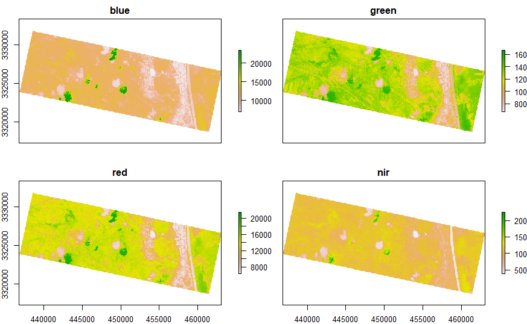
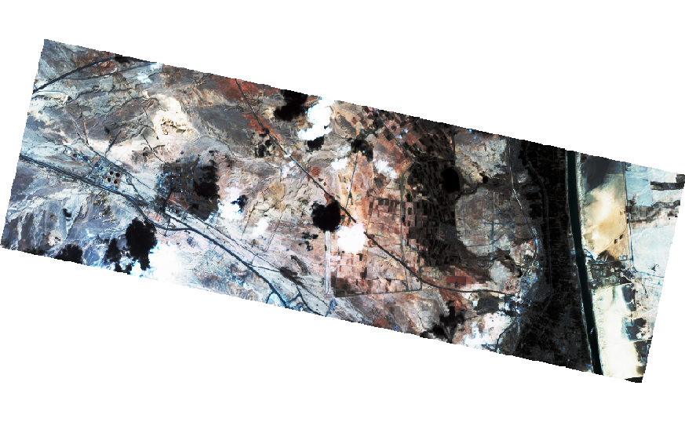
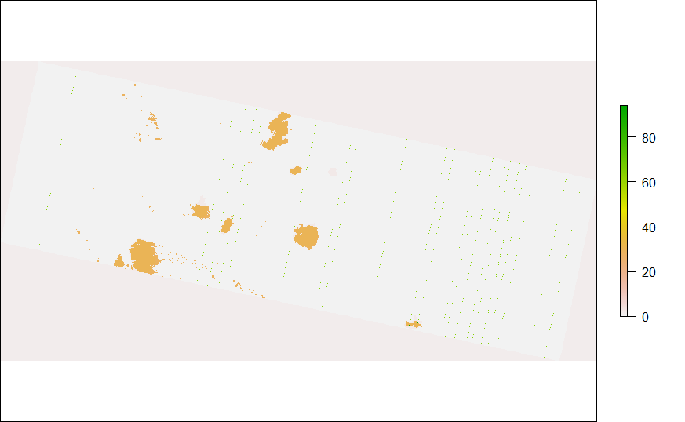
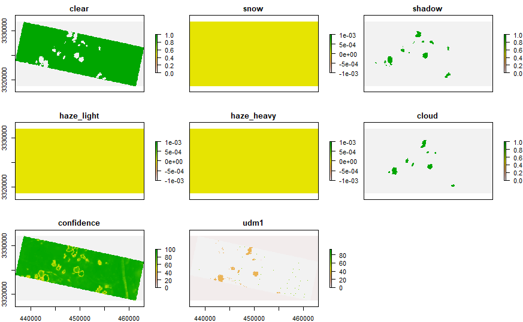
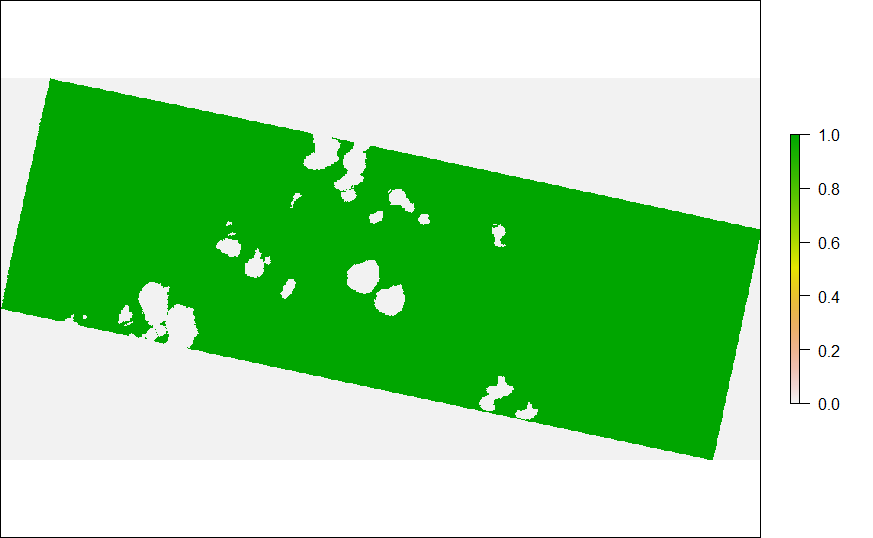
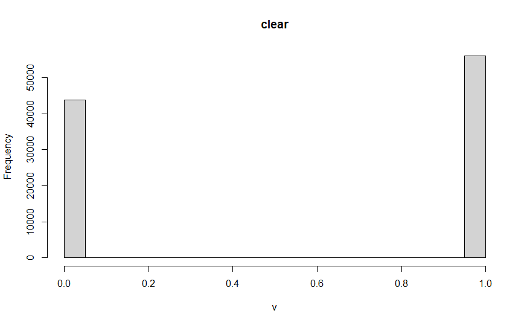
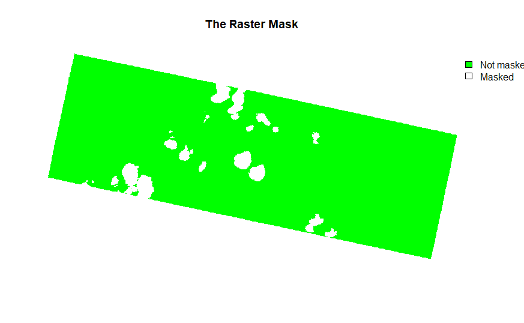
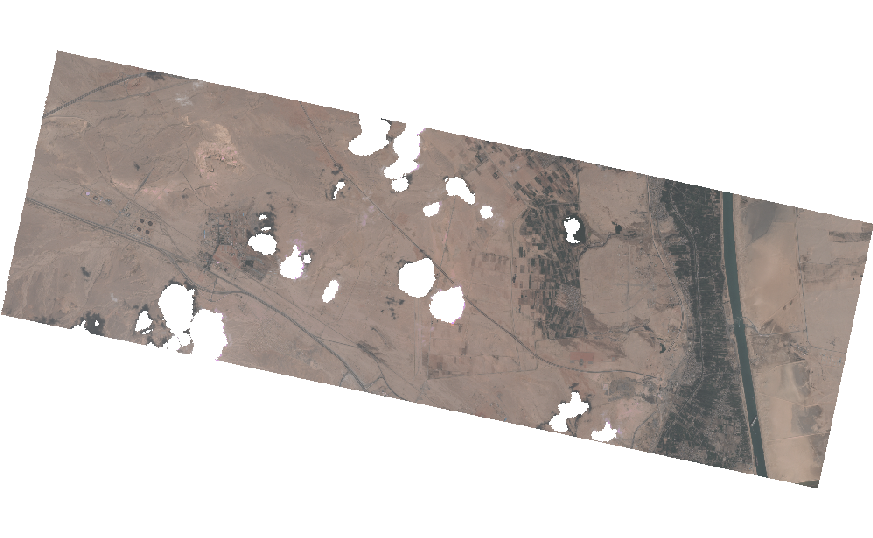

# Clean-PlanetScope-data in R
## Clouds, Shadows, and Cloud Masks

## Ever Green Ship Area
### Image: 4-band PlanetScope 
### Resolution: 3 m
### Provider: Planet Lab
### Thanks to Planet Lab for the data for Education and Research Program

## 1. Load Library
```
library(raster)
```

## 2. Load image
### 2.1 4-band PlanetScope data
```
ever_green = stack("20210325_081016_1011_3B_AnalyticMS.tif")
```

#### Plot 4-band
```
plot(ever_green)
```

<!-- -->

```
ever_green[[1]] # Blue
ever_green[[2]] # Green
ever_green[[3]] # Red
ever_green[[4]] # NIR
```

#### Plot RGB
```
plotRGB(ever_green,
        r = 3, g = 2, b = 1,
        stretch = "hist",
        legend = FALSE,
        axes = FALSE,
        box = FALSE)
```
<!-- -->

### 2.2 Analytics data
```
ever_green_analytics = stack("20210325_081016_1011_3B_AnalyticMS_DN_udm.tif")
plot(ever_green_analytics)
```
<!-- -->

### 2.3 Information
```
ever_green_info = stack("20210325_081016_1011_3B_udm2.tif")
plot(ever_green_info)
```
<!-- -->
```
# ever_green_info[[1]] # clear
# ever_green_info[[2]] # snow
# ever_green_info[[3]] # shadow
# ever_green_info[[4]] # haze_light
# ever_green_info[[5]] # haze_heavy
# ever_green_info[[6]] # cloud
# ever_green_info[[7]] # confidence
# ever_green_info[[8]] # udm1
```

## 3. Raster Masks
### 3.1 Check "clear" information
```
ever_green_clear = ever_green_info[[1]]
plot(ever_green_clear)
```
<!-- -->

```
ever_green_clear

> ever_green_clear
class      : RasterLayer 
band       : 1  (of  8  bands)
dimensions : 4394, 8754, 38465076  (nrow, ncol, ncell)
resolution : 3, 3  (x, y)
extent     : 436809, 463071, 3318738, 3331920  (xmin, xmax, ymin, ymax)
crs        : +proj=utm +zone=36 +datum=WGS84 +units=m +no_defs 
source     : C:/Users/Duke Konlavach/Desktop/To-do after graduated/Suez_Canal_blocked/Suez_Canal_blocked_PSScene4Band_Explorer/files/PSScene4Band/20210325_081016_1011/analytic_udm2/Clean-PlanetScope-data/20210325_081016_1011_3B_udm2.tif 
names      : clear 
values     : 0, 255  (min, max)
```
```
hist(ever_green_clear)
```
<!-- -->


### 3.2 Create Mask layer
```
ever_green_clear[ever_green_clear == 0] <- NA
```

```
plot(ever_green_clear,
     main = "The Raster Mask",
     col = c("green"),
     legend = FALSE,
     axes = FALSE,
     box = FALSE)

par(xpd = TRUE) # force legend to plot outside of the plot extent

legend(x = ever_green_clear@extent@xmax, ever_green_clear@extent@ymax,
       c("Not masked", "Masked"),
       fill = c("green", "white"),
       bty = "n")
```

<!-- -->


### 3.3 Apply Mask: Remove Clouds and Shadows
```
ever_green_mask <- mask(ever_green, mask = ever_green_clear)
```

```
plotRGB(ever_green_mask,
        r = 3, g = 2, b = 1,
        main = "PlanetScope RGB Image \n Clouds and Shadows removed",
        legend = FALSE,
        axes = FALSE,
        box = FALSE)
```
<!-- -->
